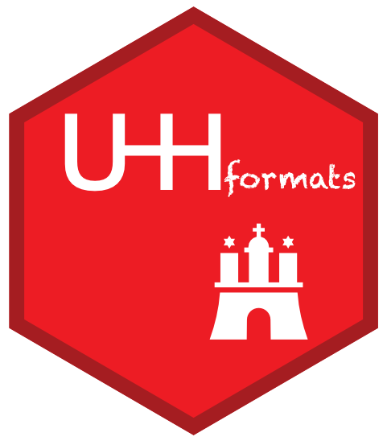
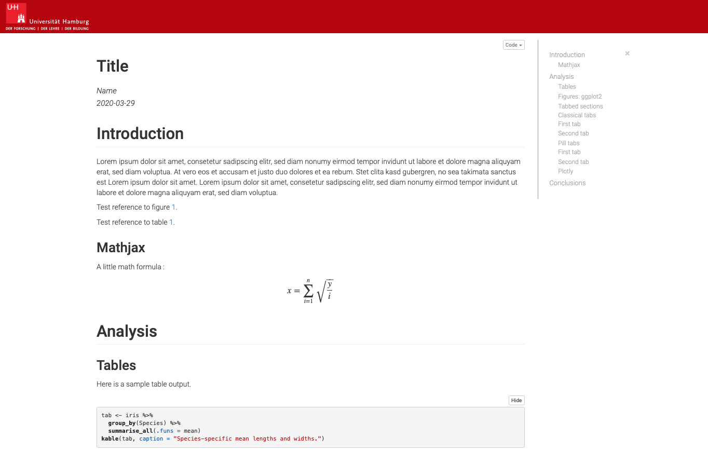
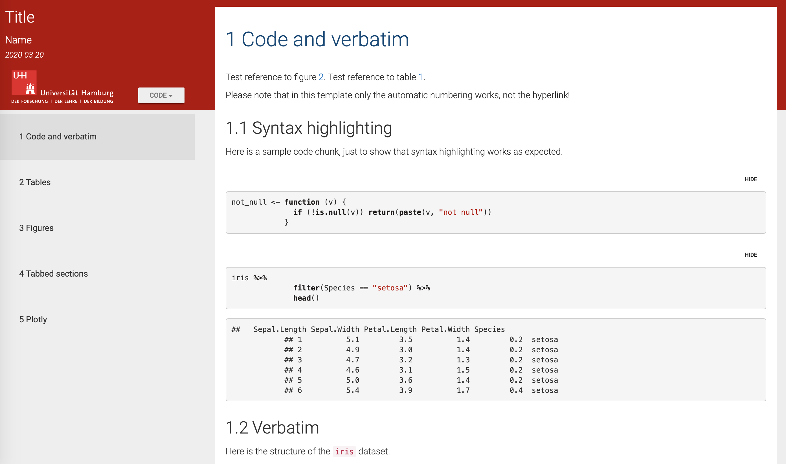
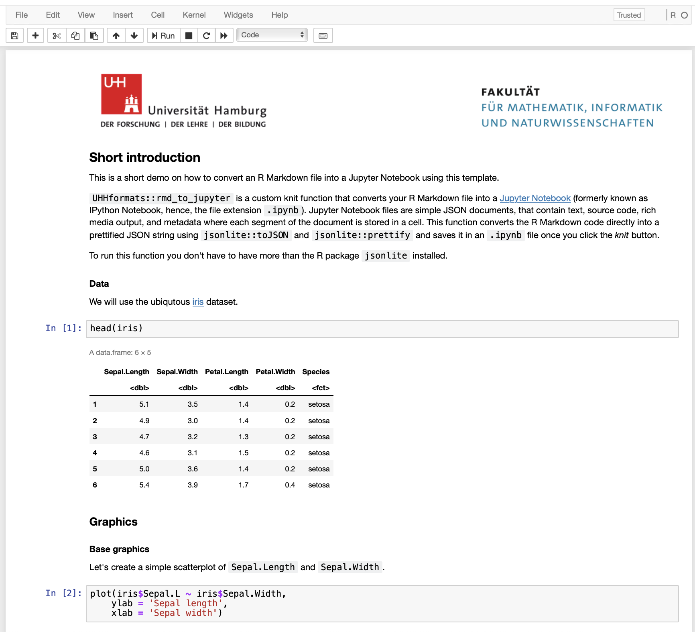
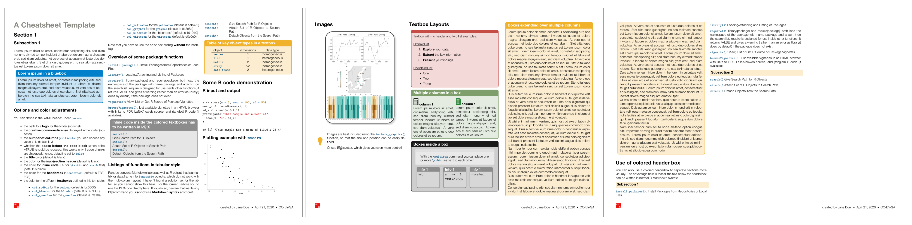
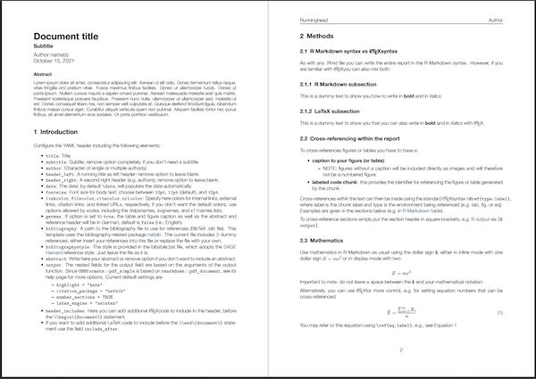
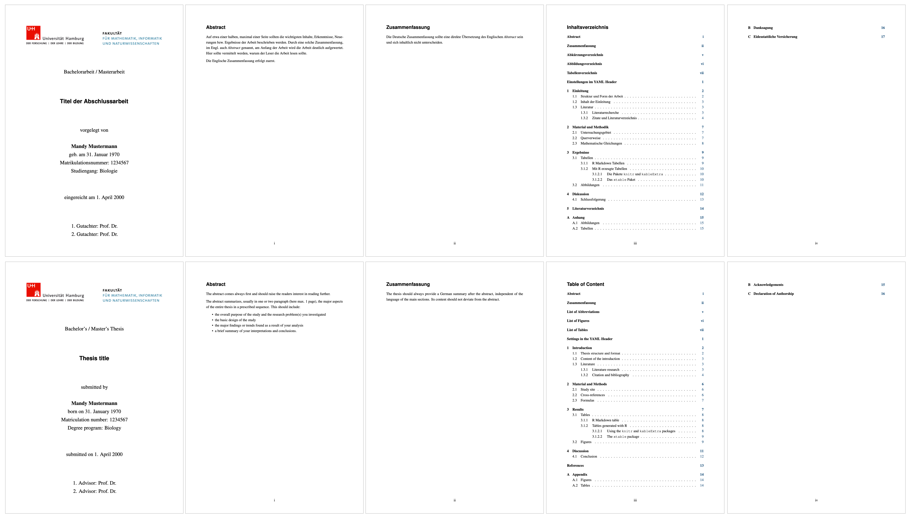

```{r setup, include=FALSE}
knitr::opts_chunk$set(echo = TRUE)
```

<!-- README.md is generated from README.Rmd. Please edit that file -->

# UHHformats 


This R package provides ready-to-use R Markdown templates for HTML and PDF output formats, which are used within the Biology Department of the University of Hamburg (UHH) and its 
[Data Science in Biology](https://datasciencebiology.blogs.uni-hamburg.de) program. The package aims to encourage reproducible research using simple Markdown syntax while embedding all of the R code to produce plots and analyses as well. Included in the package are templates for 

- student assignments, 
- cheat sheets,
- project reports,
- Bachelor/Master thesis, and 
- conversions to Jupyter Notebook documents.

Most templates include the UHH logo and have adopted the UHH corporate design, but the logo can be 
easily replaced in the YAML header and also the style can be modified, by e.g. adding your own
CSS stylesheet in the YAML header of the html template. Hence, these templates are not limited to 
UHH students and employees.

Each template was developed based on other inspiring templates and R packages, which are mentioned below.


## Installation and usage

Install the development version from GitHub using devtools:

```{r, eval = FALSE}
# install.packages("remotes")
remotes::install_github("saskiaotto/uhhformats",
  dependencies = TRUE, , build_vignettes = TRUE)
```


### Creating a new document and rendering it within R Studio

Once you installed the package you might need to close and re-open R Studio to see the `UHHformats` 
templates listed.

Choose `File` > `New File...` > `R Markdown...`, then select `From Template`.
You should be able then to create a new document from one of the package
templates:


Choose the location of the directory of your document and a name (that name will be used for both the .Rmd file and the new folder in which the .Rmd file will be placed). You can use any name you like except when creating the thesis documents (see also [Creating and rendering your thesis]).

Rendering from within R Studio is also quite simple: you just click the `Knit` button.


### Without R Studio

You can create a new directory inside your current directory, including the 
ready-to-use R Markdown file and all associated files (e.g. images, fonts, 
LaTeX templates, etc.), with the built-in function `create_doc()`, which is 
adopted from the [rmdformats](https://github.com/juba/rmdformats) package.

Use, for instance,

```r
UHHformats::create.doc(dirname = "directory_and_file_name", template = "pdf_report")
```
to generate a report-like PDF output.

Alternatively, use 

```r
rmarkdown::draft("demo.Rmd", template = "html_simple", package = "UHHformats")
```

These functions will automatically place the generated .Rmd file in a new subdirectory of 
the same name.


You can render your document into the HTML or PDF output format using the 
`render()` function from the `rmarkdown` package :

```r
rmarkdown::render("my_document.Rmd")
```

**Important note**: `rmarkdown::render` uses as default Pandoc to convert the Markdown document into HTML or PDF. While R Studio uses its internal Pandoc installation (e.g., on a Mac located in '/Applications/R Studio.app/Contents/MacOS/pandoc/'), you need to have Pandoc and its citation parser also installed on your system. See  https://pandoc.org/installing.html for instructions.


### Further requirements - LaTeX

In addition to Pandoc or R Studio being installed, you need to have [LaTeX](https://www.latex-project.org/about/) installed if you want to use the templates that convert R Markdown to PDF output formats. Depending on your operating systems there are different distributions you can use, e.g. for Mac there is [MacTeX](http://www.tug.org/mactex/), which includes [TeXShop](https://pages.uoregon.edu/koch/texshop/), a nice Mac-only editor for .tex documents. For other OS see here: https://www.latex-project.org/get/

An easy way to install LaTeX on any platform is with the [tinytex](https://yihui.org/tinytex/) R package:

```{r, eval=FALSE}
install.packages('tinytex')
tinytex::install_tinytex()
# After restarting R Studio, confirm that you have LaTeX with 
tinytex:::is_tinytex() 
```

TinyTeX is a custom LaTeX distribution based on TeX Live that is small in size but that includes most relevant functions (for R users). You may, however, still need to install a few extra LaTeX packages on your first attempt to knit when you use this package.

Although LaTeX is a powerful and popular tool in Academia, it can take a while to learn the syntax and to find the correct formatting. R Markdown and the PDF template in this packages offer a much simpler syntax and the direct embedding of figures and tables, but at the cost of loosing some of the expressiveness of LaTeX. However, you can insert LaTeX code directly into the R Markdown files and also add LaTeX packages and format styles in the YAML header.

If you want to know more about LaTeX, a good start is the *overleaf* tutorial (and its entire documentation):
https://www.overleaf.com/learn/latex/Learn_LaTeX_in_30_minutes

---

## Template gallery

### `html_simple` - HTML output format

This template converts the R Markdown file into a simple HTML file with a fixed table 
of content in the upper right corner and a code folding button similar to R notebooks, 
which is useful in student assignments.

Its function calls internally `rmarkdown::html_document` or `bookdown::html_document2`. The 
latter is the default, hence, numbered section (set to `FALSE` as default) and automatic 
numbering of figures and tables is supported. However, please note that the hyperlink in 
the cross-reference does not yet work in this template. The basis for this function and the 
HTML, CSS, and JavaScript code is the `html_clean` template developed by Julien 
Barnier in the [rmdformats](https://github.com/juba/rmdformats) package.

The current R Markdown template has in the YAML header:

```
---
title: "Title"
author: "Name"
date: "`r Sys.Date()`"
output:
  UHHformats::html_simple:
    highlight: kate
    code_folding: show
    use_bookdown: true
    number_sections: false
editor_options: 
  chunk_output_type: console
---
```

To get an overview of options that can be set in the YAML header besides `highlight`, `code_folding`, and `number_sections` see the help file for `html_simple` as well `bookdown::html_document2` or `rmarkdown::html_document`.

```{r, echo=FALSE}

```


### `html_material` - HTML output format with bootstrap design 'Material'

This template converts the R Markdown file into an HTML output file that has a navigation 
bar on the left and in which the different sections (defined by setting header level 1 (#))
are displayed on individual pages or cards. If you want all sections on a single page, add 
the `cards: false` option in the YAML header.
The design is an adaptation from the Material design theme for Bootstrap 3 project: https://github.com/FezVrasta/bootstrap-material-design.
Also in this template, the HTML, JavaScript, CSS, and R code were originally developed by 
Julien Barnier in the [rmdformats](https://github.com/juba/rmdformats) package and 
only slightly modified here to tailor it to the
[Data Science in Biology](https://datasciencebiology.blogs.uni-hamburg.de)
program at the UHH.

Similar to `html_simple`, the underlying function calls internally `rmarkdown::html_document` or (default) `bookdown::html_document2`. But here, the numbered section is set to `TRUE` as default and also the hyperlink
in the cross-references works. To get an overview of options that can be set in the YAML header besides `highlight` and `code_folding`, which are shown as examples in the R Markdown template, see the help file for `html_material` as well `bookdown::html_document2` or `rmarkdown::html_document`.

```{r, echo=FALSE}

```


#### Addtional features available in these HTML templates:

Some extra features were adopted from the [rmdformats](https://github.com/juba/rmdformats) 
package, i.e. 

- tabsets are supported like in the default template made with `rmarkdown::html_document()`
- both templates provide automatic thumbnails for figures with lightbox display


### `rmd_to_jupyter` - Jupyter Notebook output format

While I'm a strong advocate of R Studio and R Studio server as IDE for R, there are times where [Juypter Notebook][https://jupyter.org/] is clearly the better option. Not only that Jupyter Notebooks allows running R directly in the browser without the installation of additional programs when using a remote Notebook server - this is in fact what R Studio Server is also for - but students can use it from any mobile device, including smartphones. This is particularly useful during lectures, when aiming to engage students more.

So I was looking for simple approaches to convert my R Markdown files into Jupyter Notebooks. Although I found some packages such as [markdowntemplates](https://github.com/hrbrmstr/markdowntemplates) or [notedown](https://github.com/aaren/notedown) (which the former depends on) I ran into few issues:

- you have to have Python and notedown installed and correctly setup before you can start
- when opening the notebooks in Jupyter Notebook locally or using a remote server, either no or the Phyton kernel was automatically started as all code chunks were read as Python code
- when choosing the R kernel for the notebook, the `%%R` flag appeared in each code chunk and had to be removed manually

So eventually I found a simpler approach in the [rmd2jupyter](https://github.com/mkearney/rmd2jupyter) package developed my Michael Kearney and converted his function into an R Markdown template here. The underlying function is a custom knit function, which converts the R Markdown code directly into a prettified JSON string using
`jsonlite::toJSON` and `jsonlite::prettify` and saves it then in an `.ipynb` file

The only thing you need in the YAML header is therefore:

```
---
knit: UHHformats::rmd_to_jupyter
---
```

Since everything from the YAML header will be cut out when converting the code, any title, author name or other field will be neglected.

When selecting the *Jupyter Notebook* template in R Studio a directory including the `.Rmd` file and `images/` subfolder will be created. 
Open the R Markdown file and change it however you want. Once you press the *knit* button you should see a line telling you were the 
`.ipynb` file was saved. And you're done!

When opening your file in Jupyter Notebook, please note that

- if you use a local installation of Jupyter Notebook, the program will automatically have access to all the subdirectories that your file links to
(e.g. the `images/` folder or any `data/` folder)
- if you use Jupyter Notebook server you need to upload the `.ipynb` file as well as all subdirectories together as a zip file. To unzip, simply open a new R notebook and write into the first cell: `unzip("zip_file_name.zip")`.

```{r, echo=FALSE}

```


### `pdf_cheatsheet` - Output format for a simple cheat sheet

Template for creating a simple cheat sheet. The PDF output format
will be A4 sized and horizontal. You can define whether the
cheat sheet should have 2,3,4 or more columns. Also the text and box 
colors and font size can be adjusted. The [LaTeX template by Sarah
Lang](https://www.overleaf.com/latex/templates/colourful-cheatsheet-template/qdsshbjktndd) served here as inspiration for the layout and code.

The templates includes predefined \LaTeX commands for textboxes. If you 
want to use them to make your cheat sheet visually more appealing, you have
to continue coding in \LaTeX unfortunately. I didn't manage
yet to get around \LaTeX overall. However, the template .Rmd file provides 
several examples regarding the layout and \LaTeX  syntax, which is hopefully sufficient enough for the inexperienced coder.

```{r, echo=FALSE}

```


### `pdf_report` - Output format for a report in English (default) or German

This template converts the R Markdown file into a PDF/LaTeX - based  
report suitable for project reports and student assignments. The underlying 
function `pdf_report` is a wrapper of `rmarkdown::pdf_document` and based on the 
[rticles](https://github.com/R Studio/rticles) package that
provides templates for various journal articles. The Pandoc LaTeX template
and the report layout are inspired by INWTlab's
[ireports](https://github.com/INWTlab/ireports) package.

In the YAML header of the R Markdown template, you can easily customize the
logos and cover image, the language, the bibliography style or even add your own
LaTeX style with the `include-after` option:

```
---
title: "Document title"
author: "Author name(s)"
date: \today
fontsize: 11pt
german: false
bibliography: bibfile.bib       
bibliographystyle: bibstyle.bst
params:
  cover: images/cover.png
  title_logo_left: images/uhh_logo.png
  title_logo_right: images/min_logo.png
  logo_small: images/logo_icon.png
output:
  UHHformats::pdf_report:
    df_print: kable
---
```

For more details on available arguments in `pdf_report` (in addition to `df_print` as 
shown here) see its help file as well as the  help for `rmarkdown::pdf_document`.

```{r, echo=FALSE}
knitr::include_graphics("tools/images/img_pdf_report.png")
```


### `pdf_simple` - Output format for a simple PDF document in English (default) or German

This template converts the R Markdown file into a simple PDF/LaTeX - based  
document structured as an article, which is suitable for student assignments. The underlying 
function `pdf_simple` is a wrapper of `rmarkdown::pdf_document`. Similar to the `pdf_report` 
template, the YAML header offers various options to adjust the layout of the document.

In the YAML header of the R Markdown template, you can easily customize the
logos and cover image, the language, the bibliography style or even add your own
LaTeX style with the `include-after` option:

```{r, echo=FALSE}

```


### `pdf_thesis_en` and `pdf_thesis_de` - PDF output format for BSc/Msc thesis in English and German

The package provides a comprehensive template for writing a Bachelor's/ Master's Thesis at the
UHH Biology Department and rendering those files in a PDF format following the 
official guidelines of the Department's Academic office for the [Bachelor thesis](https://www.biologie.uni-hamburg.de/studium/download/bachelor/vorgabe-bachelorarbeit.pdf) as well as [Master thesis](https://www.biologie.uni-hamburg.de/studium/download/master/vorgaben-masterarbeit-biologie.pdf). The template comes in two versions, one in German (`pdf_thesis_de`) and one in English (`pdf_thesis_en`).

The underlying LaTeX templates are based on the University templates provided by the [Department of Socioeconomics](https://www.wiso.uni-hamburg.de/fachbereich-sozoek/professuren/szimayer/lehre/wissenschaftliche-arbeiten/bachelorarbeiten/vorlagen-fuer-abschlussarbeiten-in-latex-format.html) as well as the Department of Informatics working groups [VSIS](https://vsis-www.informatik.uni-hamburg.de/vsis/teaching/templates) and [Security & Privacy](https://www.inf.uni-hamburg.de/inst/ab/snp/courses/material/templates.html).

These two templates built on the [thesisdown](https://github.com/ismayc/thesisdown) 
package by Chester Ismay with adjustments to meet the UHH requirements. The underlying function wraps around the  `pdf_book()` function from the [bookdown](https://bookdown.org/home/about/) package, which is more suitable for books and log-format reports and which provides additional features such as figure/table caption numbering, cross-references or inserting parts/appendices. `bookdown` also allows the splitting of chapters or sections into individual files, keeping it thereby more tidy. If you've never came across `bookdown` before, it can be helpful to read up on its
documentation: https://bookdown.org/yihui/bookdown/.


```{r, echo=FALSE}

```


#### Creating and rendering your thesis

Creating the thesis document is not much different from the other templates in this package, with one exception, i.e. you have to name your .Rmd file `index.Rmd`. So there are two options:

1. When assigning a name to the thesis directory (and .Rmd file) in the dialog box "New R Markdown" or in the create_doc/draft function write *index* → if you like the thesis folder to have a more expressive name re-name the folder later.
2. Do the exactly the opposite, i.e. name your directory however you like and directly after all files have been created name the .Rmd file `index.Rmd`.


This `index.Rmd` file is the only file in your thesis directory you'll ever going to knit! You can see this as none of the other chapter .Rmd files has a YAML header to tell what the output format should be like. Hence, you are going to press the *knit* button for these files, R Studio will render them as default into an HTML file.

The output PDF that is rendered from the `index.Rmd` file will be placed in a new `thesis-output/` subdirectory along with its LaTeX file. 


#### Thesis components

The following components are ones you should edit to customize your thesis. Note that the template contains in all files some dummy text to provide you some guidance and additional information. This should be deleted of course.

### `index.Rmd`

This file contains the [YAML](https://yaml.org/) header, i.e. all the meta information, which should always be at the beginning of your document. In fact, the file shouldn't contain anything else than that! The starting text you'll see after creating the file is just for your information. Edit line 3-11 to have your name, thesis title, etc. on the title page.

### `_bookdown.yml`

This is the main configuration file for your thesis. It determines what .Rmd files are included in the output, and in what order. Arrange the order of your chapters in this file and ensure that the names match the names in your folders. 

### `prelim/`

This folder contains .Rmd files for the sections that come before the main part of your thesis, i.e. the *Abstract*, *Zusammenfassung* (the German summary), and the *List of Abbreviations* (optional). The *List of Tables* and *List of Figures*, which are also optional, are automatically generated so now .Rmd file is required.

### `chapter/`

This contains the .Rmd files for each chapter in your dissertation (e.g. `01-intro.Rmd`, `02-methods.Rmd`, etc.). Write your thesis in these. If you're writing in R Studio, you may find the package [wordcountaddin](https://github.com/benmarwick/wordcountaddin) useful for getting word counts and readability statistics in R Markdown documents.

### `bib/`

Store your bibliography (as .bib file(s)) and your style file (as .csl file) here. A good source for
citation styles is this [CSL Style Repository](https://github.com/citation-style-language/styles#readme). A useful tool for easy citation insertions is the [citr](https://github.com/crsh/citr) add-in. If you are using the reference management software [Zotero](https://www.zotero.org/) the add-in can even access your reference database directly. 

### `data/` and `images/`

Store your data files and all external images that are embedded in your thesis here and reference them in your R Markdown files. See the *method* chapter in the template and chapter [2.2.1](https://bookdown.org/yihui/bookdown/markdown-extensions-by-bookdown.html#equations) in the bookdown online documentation for details on cross-referencing tables and figures in R Markdown.


#### Fine-tuning the thesis format at the very last moment

If you like to change some of the format and are familiar with LaTeX you can also open the rendered `thesis.tex` file in your system's LaTeX editor, make the changes and recompile it. But note that whenever you *knit* your `index.Rmd` again, your changes in the LaTeX file will be overwritten. So this should be only done once the content of your thesis doesn't change.

A better way to add your personal format style is to add LaTeX code in the YAML header under the option `header-includes:` since that style will be included every time you render your document. 


----


## Useful resources

- R Markdown
    - The official R Markdown documentation: https://rmarkdown.R Studio.com/lesson-1.html
    - R Markdown [reference guide](https://www.R Studio.com/wp-content/uploads/2015/03/rmarkdown-reference.pdf)
    - R Markdown [cheatsheet](https://github.com/R Studio/cheatsheets/raw/master/rmarkdown-2.0.pdf)
    - The online book [R Markdown: The Definitive Guide](https://bookdown.org/yihui/rmarkdown/) by Yihui Xie, J. J. Allaire, and Garrett Grolemund
- The online book [bookdown: Authoring Books and Technical Documents with R Markdown](https://bookdown.org/yihui/bookdown/) by Yihui Xie
- LaTeX
    - The official [LaTeX help and documentation](https://www.latex-project.org/help/documentation/)
    - The [overleaf](https://www.overleaf.com/learn) documentation
- W3Schools Online Web Tutorial for [HTML](https://www.w3schools.com/html/default.asp) and for [CSS](https://www.w3schools.com/css/default.asp).


## Credits

1. Julien Barnier's [rmdformats](https://github.com/juba/rmdformats) package
2. The [slidify](https://github.com/ramnathv/slidify) package by Ramnath Vaidyanathan
3. The [rticles](https://github.com/rstudio/rticles) package
4. INWTlab's [ireports](https://github.com/INWTlab/ireports) package
5. Chester Ismay's [thesisdown](https://github.com/ismayc/thesisdown) package
6. Michael Kearney's [rmd2jupyter](https://github.com/mkearney/rmd2jupyter) package
7. Sarah Lang's [LaTeX template for a cheat sheet](https://www.overleaf.com/latex/templates/colourful-cheatsheet-template/qdsshbjktndd)

