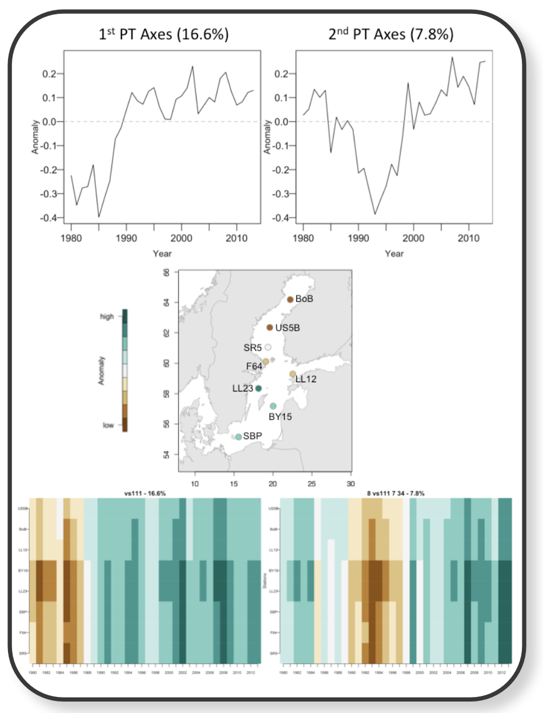

```{r setup, include = FALSE}
knitr::opts_chunk$set(echo = FALSE, message = FALSE, 
  warning = FALSE, error = FALSE, cache = FALSE)
```

```{r load-packages, include = FALSE}
# packages
library(knitr)
library(tidyverse)
```

# A Cheatsheet Template

## Section 1

### Subsection 1

Lorem ipsum dolor sit amet, consetetur sadipscing elitr, sed diam nonumy eirmod tempor invidunt ut labore et dolore magna aliquyam erat, sed diam voluptua. At vero eos et accusam et justo duo dolores et ea rebum. Stet clita kasd gubergren, no sea takimata sanctus est Lorem ipsum dolor sit amet. 

\begin{bluebox}{Lorem ipsum in a bluebox}
Lorem ipsum dolor sit amet, consetetur sadipscing elitr, sed diam nonumy eirmod tempor invidunt ut labore et dolore magna aliquyam erat, sed diam voluptua. At vero eos et accusam et justo duo dolores et ea rebum. Stet clita kasd gubergren, no sea takimata sanctus est Lorem ipsum dolor sit amet.
\end{bluebox}

### Options and color adjustments

You can define in the YAML header under `params`

* the path to a **logo** for the footer (optional)
* the **creative commons license** displayed in the footer (optional)
* the **number of columns** (`multicols`); you can choose any value > 1, default is 3
* whether the **space before the code block** (when echo =TRUE) should be reduced; this works only if code chunks are displayed, hence, default is set to `false`
* the **title** color (default is black)
* the color for the **(sub)section header** (default is black)
* the color for **inline code** (i.e. for `\texttt` and `\verb` text) (default is black)
* the color for the **headerbox** (`\headerbox`) (default is FBEFCE)
* the color for the different **textboxes** defined in this template:
    + `col_redbox` for the `redbox` (default is bc0000)
    + `col_bluebox` for the `bluebox` (default is 027BCB)
    + `col_greenbox` for the `greenbox` (default is 7fa16a)
    + `col_yellowbox` for the `yellowbox` (default is eeb422)
    + `col_graybox` for the `graybox` (default is 8c8c8c)
    + `col_blackbox` for the `blackbox`` (default is 191919)
    + `col_whitebox` for the `whitebox` (default is e0e0e0)

Note that you have to use the color hex coding **without** the hashtag. If you need more colors than these 7, you can define 14 more colors by appending the number 2 or 3 to each color and box, e.g. `col_redbox2` and `col_redbox3` for `redbox2` and `redbox3`, respectively.


### Overview of some package functions

`install.packages()`: Install packages from repositories or local files.

`library()`: Loading/attaching and listing of packages.

`require()`: library(pkg) and require(pkg) both load the namespace of the package *pkg* and attach it on the search list. require is designed for use inside other functions; it returns FALSE and gives a warning (rather than an error as library() does by default) if the package does not exist.

`vignette()`: View, list or get R source of package vignettes.

`browseVignettes()`: List available vignettes in an HTML browser with links to PDF, LaTeX/noweb source, and (tangled) R code (if available).

\begin{graybox}{Inline code inside the colored textboxes has to be written in \LaTeX}

\verb!search()!: \newline
Give search path for R objects.

\verb!attach()!: \\
Attach set of R objects to search path.

\verb!detach()!: \\
Detach objects from the search path.

\end{graybox}


### Listings of functions in tabular style

Pandoc converts Markdown tables as well as R output that is a matrix or data.frame  into `longtable` objects, which do not work with the multi-column layout. I haven't found a solution yet for the latter, so you cannot show this here. For the former I advise you to use the \LaTeX code directly here. If you do so, beware that inside any \LaTeX command you **cannot** use **Markdown syntax** anymore!

<!-- column widths should not be > 7cm in total if multicols = 3 -->
\begin{tabular}{p{2cm}p{5cm}}  
  \verb!search()! & Give search path for R objects. \\
  \verb!attach()! & Attach set of R objects to search path. \\
  \verb!detach()! & Detach objects from the search path. \\
\end{tabular}

<!-- p{} shows text left-aligned, P{} centered -->
\begin{yellowbox}{Table of key object types in a textbox}
  \begin{center}
  \begin{tabular}{p{2cm}P{2cm}P{2cm}} 
  object & dimensions & data type\\
  \hline
  \verb!vector!  & 1 & homogeneous \\
  \verb!list!  & 1 & heterogeneous \\
  \verb!matrix! & 2 & homogeneous \\
  \verb!array!  & >2 & homogeneous \\
  \verb!data.frame!  & 2 & heterogeneous
  \end{tabular}
  \end{center}
\end{yellowbox}


## Some R code demonstration

### R input and output
```{r}
x <- rnorm(n = 5, mean = 100, sd = 50)
mean_x <- round(mean(x), 1)
sd_x <- round(sd(x),1)
print(paste("This sample has a mean of",
  mean_x, "±", sd_x)
)
```

### Plotting example with `mtcars`
```{r eval=TRUE, echo=FALSE, out.width="80%", fig.align='left'}
mtcars %>%
  ggplot(aes(mpg, disp)) +
  geom_point() +
  theme_classic()
```

\newpage

## Images

```{r echo=FALSE, out.width="80%", fig.align="center"}

```


\begin{wrapfigure}[4]{l}{1cm}
  \centering
  \includegraphics[width=0.5cm]{images/lightbulb.png}
\end{wrapfigure}
<!-- the [4] after {wrapfigure} defines that wrapping stops after 4 lines -->
<!-- this is important to not wrap the next section -->

Images are best included using the `include_graphics()` function so that the size and position can be easily defined.

Or use \LaTeX syntax, which gives you even more control!

\vfill

## Textbox Layouts

\begin{redbox}

  Textbox with no header and two list examples: \\
  
  \underline{Ordered list}
  \begin{enumerate}
  \item \textbf{Explore} your data
  \item \textbf{Extract} the key information
  \item \textbf{Present} your findings
  \end{enumerate}
  
  \underline{Unordered list}
  \begin{itemize}
      \item One
      \item Two
      \item Three
  \end{itemize}
\end{redbox}

\begin{greenbox}{Multiple columns in a box}
  \begin{multicols}{2}
  \includegraphics[width=0.5cm]{images/calculator.png}
  \textbf{column 1} \\
  Lorem ipsum dolor sit amet, consetetur sadipscing elitr, sed diam nonumy eirmod tempor invidunt ut labore et dolore magna aliquyam erat, sed diam voluptua. At vero eos et accusam et justo duo dolores et ea rebum.
  \columnbreak
  
  \includegraphics[width=0.5cm]{images/checklist2.png}
  \textbf{column 1}\\
  Lorem ipsum dolor sit amet, consetetur sadipscing elitr, sed diam nonumy eirmod tempor invidunt ut labore et dolore magna aliquyam erat, sed diam voluptua. At vero eos et accusam et justo duo dolores et ea rebum. 
  \end{multicols}
\end{greenbox}


<!-- ---------------------------- -->
\begin{blackbox}{Boxes inside a box}

 \begin{whitebox}
 
  With the \verb!\multibox! command you can place one or more \verb!\subbox!es next to each other:
  \end{whitebox}

  \begin{multibox}{3} 
  \begin{subbox}{colgraybox}{Info 1}
  info
  \end{subbox}
  \begin{subbox}{colgraybox}{Info 1}
  $a \to b$
  \mycommand{CTRL+C}{copy}
  \end{subbox}
  \begin{subbox}{colgraybox}{Info 1}
  more text
  \end{subbox}
  \end{multibox}

\end{blackbox}

\columnbreak

\begin{yellowbox}{Boxes extending over multiple columns}
Lorem ipsum dolor sit amet, consetetur sadipscing elitr, sed diam nonumy eirmod tempor invidunt ut labore et dolore magna aliquyam erat, sed diam voluptua. At vero eos et accusam et justo duo dolores et ea rebum. Stet clita kasd gubergren, no sea takimata sanctus est Lorem ipsum dolor sit amet. Lorem ipsum dolor sit amet, consetetur sadipscing elitr, sed diam nonumy eirmod tempor invidunt ut labore et dolore magna aliquyam erat, sed diam voluptua. At vero eos et accusam et justo duo dolores et ea rebum. Stet clita kasd gubergren, no sea takimata sanctus est Lorem ipsum dolor sit amet. Lorem ipsum dolor sit amet, consetetur sadipscing elitr, sed diam nonumy eirmod tempor invidunt ut labore et dolore magna aliquyam erat, sed diam voluptua. At vero eos et accusam et justo duo dolores et ea rebum. Stet clita kasd gubergren, no sea takimata sanctus est Lorem ipsum dolor sit amet.   

Duis autem vel eum iriure dolor in hendrerit in vulputate velit esse molestie consequat, vel illum dolore eu feugiat nulla facilisis at vero eros et accumsan et iusto odio dignissim qui blandit praesent luptatum zzril delenit augue duis dolore te feugait nulla facilisi. Lorem ipsum dolor sit amet, consectetuer adipiscing elit, sed diam nonummy nibh euismod tincidunt ut laoreet dolore magna aliquam erat volutpat.   

Ut wisi enim ad minim veniam, quis nostrud exerci tation ullamcorper suscipit lobortis nisl ut aliquip ex ea commodo consequat. Duis autem vel eum iriure dolor in hendrerit in vulputate velit esse molestie consequat, vel illum dolore eu feugiat nulla facilisis at vero eros et accumsan et iusto odio dignissim qui blandit praesent luptatum zzril delenit augue duis dolore te feugait nulla facilisi.   

Nam liber tempor cum soluta nobis eleifend option congue nihil imperdiet doming id quod mazim placerat facer possim assum. Lorem ipsum dolor sit amet, consectetuer adipiscing elit, sed diam nonummy nibh euismod tincidunt ut laoreet dolore magna aliquam erat volutpat. Ut wisi enim ad minim veniam, quis nostrud exerci tation ullamcorper suscipit lobortis nisl ut aliquip ex ea commodo consequat.   

Duis autem vel eum iriure dolor in hendrerit in vulputate velit esse molestie consequat, vel illum dolore eu feugiat nulla facilisis.   

Consetetur sadipscing elitr, sed diam nonumy eirmod tempor invidunt ut labore et dolore magna aliquyam erat, sed diam voluptua. At vero eos et accusam et justo duo dolores et ea rebum. Stet clita kasd gubergren, no sea takimata sanctus est Lorem ipsum dolor sit amet. Lorem ipsum dolor sit amet, consetetur sadipscing elitr, sed diam nonumy eirmod tempor invidunt ut labore et dolore magna aliquyam erat, sed diam voluptua. At vero eos et accusam et justo duo dolores et ea rebum. Stet clita kasd gubergren, no sea takimata sanctus est Lorem ipsum dolor sit amet. Lorem ipsum dolor sit amet, consetetur sadipscing elitr, sed diam nonumy eirmod tempor invidunt ut labore et dolore magna aliquyam erat, sed diam voluptua. At vero eos et accusam et justo duo dolores et ea rebum. Stet clita kasd gubergren, no sea takimata sanctus.   

Duis autem vel eum iriure dolor in hendrerit in vulputate velit esse molestie consequat, vel illum dolore eu feugiat nulla facilisis at vero eros et accumsan et iusto odio dignissim qui blandit praesent luptatum zzril delenit augue duis dolore te feugait nulla facilisi. Lorem ipsum dolor sit amet, consectetuer adipiscing elit, sed diam nonummy nibh euismod tincidunt ut laoreet dolore magna aliquam erat volutpat.   

Ut wisi enim ad minim veniam, quis nostrud exerci tation ullamcorper suscipit lobortis nisl ut aliquip ex ea commodo consequat. Duis autem vel eum iriure dolor in hendrerit in vulputate velit esse molestie consequat, vel illum dolore eu feugiat nulla facilisis at vero eros et accumsan et iusto odio dignissim qui blandit praesent luptatum zzril delenit augue duis dolore te feugait nulla facilisi.   

Nam liber tempor cum soluta nobis eleifend option congue nihil imperdiet doming id quod mazim placerat facer possim assum. Lorem ipsum dolor sit amet, consectetuer adipiscing elit, sed diam nonummy nibh euismod tincidunt ut laoreet dolore magna aliquam erat volutpat. Ut wisi enim ad minim veniam, quis nostrud exerci tation ullamcorper suscipit lobortis nisl ut aliquip ex ea commodo

\end{yellowbox}

## Use of colored header box

You can also use a colored headerbox to separate sections more visually. The advantage here is that all the text below the headerbox can be written in normal R Markdown syntax:

\headerbox{Subsection 1}

`install.packages()`: Install packages from repositories or local files.

`library()`: Loading/attaching and listing of packages.

`require()`: library(pkg) and require(pkg) both load the namespace of the package *pkg* and attach it on the search list. require is designed for use inside other functions; it returns FALSE and gives a warning (rather than an error as library() does by default) if the package does not exist.

`vignette()`: View, list or get R source of package vignettes.

`browseVignettes()`: List available vignettes in an HTML browser with links to PDF, LaTeX/noweb source, and (tangled) R code (if available).

\headerbox{Subsection 2}

`search()`
Give search path for R objects.

`attach()`
Attach set of R objects to search path.

`detach()`
Detach objects from the search path.


