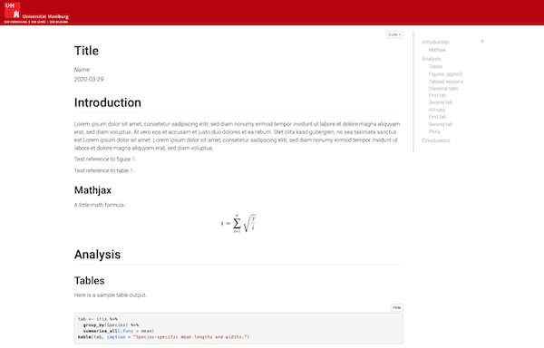
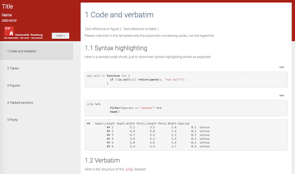
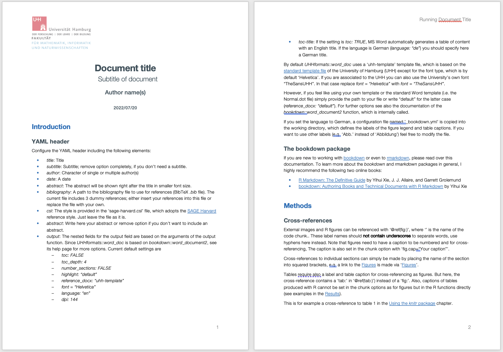
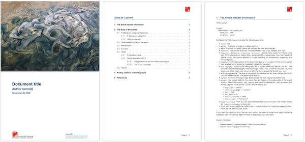
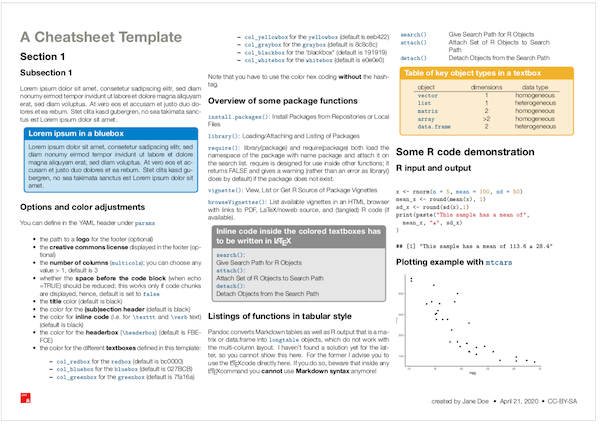

<!-- README.md is generated from README.Rmd. Please edit that file -->

# UHHformats 

<!-- [](https://github.com/saskiaotto/UHHformats/actions/workflows/check-standard.yaml) -->

This R package provides ready-to-use R Markdown templates for HTML, PDF
and Microsoft Word output formats, which are used within the Biology
Department of the University of Hamburg (UHH) and its *Data Science in
Biology* program. The package aims to encourage reproducible research
using simple Markdown syntax while embedding all of the R code to
produce plots and analyses as well. Included in the package are
templates for

-   Word documents,
-   student assignments,
-   project HTML files and PDF reports,
-   cheat sheets, and
-   conversions to Jupyter Notebook documents.

The default font for all templates is ‘Helvetica’ but can be replaced
with the University’s own font style ‘TheSans UHH’ in the PDF and Word
templates. If you are associated to the UHH you are allowed to use this
font. Most templates include further the UHH logo and have adopted the
UHH corporate design, but the logo can easily be replaced in the YAML
header and also the style can be modified, by e.g. adding your own CSS
stylesheet in the YAML header of the HTML template. Hence, these
templates are not limited to UHH students and employees.

Each template was developed based on other inspiring templates and R
packages, which are mentioned below. **To help getting started, all
templates contain already some example text and code** for formatting
text, writing equations, creating tables and figures with
cross-references and including references.

**NEW in this version**: a new Word template was added and the templates
for the Bachelor and Master thesis have been moved into a separate R
package named *UHHthesis* (see
<https://github.com/saskiaotto/UHHthesis/>).

## Installation

Install the development version from GitHub using the *remotes* package:

``` r
if (!require("remotes")) install.packages("remotes")
remotes::install_github("saskiaotto/uhhformats", build_vignettes = TRUE)
```

## Getting started

### Creating a new document and rendering it within R Studio

Once you installed the package you might need to close and re-open R
Studio to see the `UHHformats` templates listed.

1.  Choose **File** \> **New File** \> **R Markdown**, then select
    **From Template**. You should then be able to create a new document
    from one of the package templates:


2.  Choose the directory in which you want to save your file and provide
    a file name (that name will be used for both the .Rmd file and the
    new folder in which the .Rmd file will be placed).

3.  If you are interested in the documentation already provided in the
    template file for getting started, render the document once before
    you start changing the content (click the `Knit` button).

### Without R Studio

You can create a new directory inside your current directory, including
the ready-to-use R Markdown file and all associated files (e.g. images,
fonts, LaTeX templates, etc.), with the built-in function
`create_doc()`, which is adopted from the
[rmdformats](https://github.com/juba/rmdformats) package.

Use, for instance,

``` r
UHHformats::create_doc(dirname = "new-doc", template = "pdf_report")
```

to generate a report-like PDF output.

Alternatively, use

``` r
rmarkdown::draft("new-doc.Rmd", template = "html_simple", package = "UHHformats")
```

These functions will automatically place the generated .Rmd file in a
new subdirectory of the same name.

You can render your document into the HTML, PDF or Word output format
using the `render()` function from the `rmarkdown` package :

``` r
setwd("./new-doc")
rmarkdown::render("new-doc.Rmd")
```

**Important note**: `rmarkdown::render` uses as default Pandoc to
convert the Markdown document into HTML or PDF. While R Studio uses its
internal Pandoc installation (e.g., on a Mac located in ‘/Applications/R
Studio.app/Contents/MacOS/pandoc/’), you need to have Pandoc and its
citation parser also installed on your system. See
<https://pandoc.org/installing.html> for instructions. This book chapter
is also helpful:
<https://bookdown.org/yihui/rmarkdown-cookbook/install-pandoc.html>

### Further requirements - LaTeX

In addition to Pandoc or R Studio being installed, you need to have
[LaTeX](https://www.latex-project.org/about/) installed if you want to
use the templates that convert R Markdown to PDF output formats.
Depending on your operating systems there are different distributions
you can use, e.g. for Mac there is [MacTeX](http://www.tug.org/mactex/),
which includes [TeXShop](https://pages.uoregon.edu/koch/texshop/), a
nice Mac-only editor for .tex documents. For other OS see here:
<https://www.latex-project.org/get/>

An easy way to install LaTeX on any platform is with the
[tinytex](https://yihui.org/tinytex/) R package:

``` r
install.packages('tinytex')
tinytex::install_tinytex()
# After restarting R Studio, confirm that you have LaTeX with 
tinytex:::is_tinytex() 
```

TinyTeX is a custom LaTeX distribution based on TeX Live that is small
in size but that includes most relevant functions (for R users). You
may, however, still need to install a few extra LaTeX packages on your
first attempt to knit when you use this package.

Although LaTeX is a powerful and popular tool in Academia, it can take a
while to learn the syntax and to find the correct formatting. R Markdown
and the PDF template in this packages offer a much simpler syntax and
the direct embedding of figures and tables, but at the cost of loosing
some of the expressiveness of LaTeX. However, you can insert LaTeX code
directly into the R Markdown files and also add LaTeX packages and
format styles in the YAML header.

If you want to know more about LaTeX, a good start is the *overleaf*
tutorial (and its entire documentation):
<https://www.overleaf.com/learn/latex/Learn_LaTeX_in_30_minutes>

------------------------------------------------------------------------

## Template gallery

### `html_simple` - Simple HTML output format

→ for an example file see also
[here](https://github.com/saskiaotto/UHHformats/blob/master/resources/examples/demo_html_simple.html).

This template converts the R Markdown file into a simple HTML file with
a fixed table of content in the upper right corner and a code folding
button similar to R notebooks, which is useful in student assignments.

Its function calls internally `rmarkdown::html_document` or
`bookdown::html_document2`. The latter is the default, hence, numbered
section (set to `FALSE` as default) and automatic numbering of figures
and tables is supported. However, please note that the hyperlink in the
cross-reference does not yet work in this template. The basis for this
function and the HTML, CSS, and JavaScript code is the `html_clean`
template developed by Julien Barnier in the
[rmdformats](https://github.com/juba/rmdformats) package.

The current R Markdown template has in the YAML header:

    ---
    title: "Title"
    author: "Name"
    date: "2022-07-25"
    output:
      UHHformats::html_simple:
        highlight: kate
        code_folding: show
        use_bookdown: true
        number_sections: false
    editor_options: 
      chunk_output_type: console
    ---

To get an overview of options that can be set in the YAML header besides
`highlight`, `code_folding`, and `number_sections` see the help file for
`html_simple` as well `bookdown::html_document2` or
`rmarkdown::html_document`.



### `html_material` - HTML output format with bootstrap design ‘Material’

→ for an example file see also
[here](https://github.com/saskiaotto/UHHformats/blob/master/resources/examples/demo_html_material.html).

This template converts the R Markdown file into an HTML output file that
has a navigation bar on the left and in which the different sections
(defined by setting header level 1 (#)) are displayed on individual
pages or cards. If you want all sections on a single page, add the
`cards: false` option in the YAML header. The design is an adaptation
from the Material design theme for Bootstrap 3 project:
<https://github.com/FezVrasta/bootstrap-material-design>. Also in this
template, the HTML, JavaScript, CSS, and R code were originally
developed by Julien Barnier in the
[rmdformats](https://github.com/juba/rmdformats) package and only
slightly modified here to tailor it to the *Data Science in Biology*
program at the UHH.

Similar to `html_simple`, the underlying function calls internally
`rmarkdown::html_document` or (default) `bookdown::html_document2`. But
here, the numbered section is set to `TRUE` as default and also the
hyperlink in the cross-references works. To get an overview of options
that can be set in the YAML header besides `highlight` and
`code_folding`, which are shown as examples in the R Markdown template,
see the help file for `html_material` as well `bookdown::html_document2`
or `rmarkdown::html_document`.



#### Addtional features available in these HTML templates:

Some extra features were adopted from the
[rmdformats](https://github.com/juba/rmdformats) package, i.e. 

-   tabsets are supported like in the default template made with
    `rmarkdown::html_document()`
-   both templates provide automatic thumbnails for figures with
    lightbox display

### `word_doc` - Output format for a Microsoft Word document in English (default) or German

→ for an example file see also
[here](https://github.com/saskiaotto/UHHformats/blob/master/resources/examples/demo_word_doc.docx).

This template converts the R Markdown file into a Microsoft Word
document, which is suitable for student assignments or project reports.
The underlying function `word_doc` is a wrapper of
`bookdown::word_document2`. By using internally *bookdown* the language
settings for figure legends and table captions can be automatically
changed from English to German (or any other language).

In the YAML header of the R Markdown template, you can easily customize
the language, font, the bibliography style or whether to include a table
of content and the title of it. By default `word_doc` uses a
‘uhh-template’ template file, which is based on the [standard template
file](https://www.kus.uni-hamburg.de/themen/oeffentlichkeitsarbeit/corporate-design/vorlagen.html)
of the University of Hamburg (UHH) except for the font type, which is
set to ‘Helvetica’. If you are associated to the UHH you can also use
the University’s own font “TheSansUHH”. In that case replace *font =
“Helvetica”* with *font = “TheSansUHH”*.

If you feel like using your own template or the standard Word template
(i.e. the Normal.dot file) simply provide the path to your file or write
“default” for the latter case (*reference_docx: “default”*). You can
also use another font by using the setting *font = “other”* and
replacing the ‘font_XXX.ttf’ files in the working directory with your
own files. Please note, that you have to name these files exactly as the
template font files.

If you set the language to German, a configuration file named
’\_bookdown.yml’ is copied into the working directory, which defines the
labels of the figure legend and table captions. If you want to use other
labels (e.g. ‘Abb.’ instead of ‘Abbildung’) feel free to modify the
file.



### `pdf_simple` - Output format for a simple PDF document in English (default) or German

→ for an example file see also
[here](https://github.com/saskiaotto/UHHformats/blob/master/resources/examples/demo_pdf_simple.pdf).

This template converts the R Markdown file into a simple PDF/LaTeX -
based document structured as an article, which is suitable for student
assignments. The underlying function `pdf_simple` is a wrapper of
`rmarkdown::pdf_document`. Similar to the `pdf_report` template, the
YAML header offers various options to adjust the layout of the document.

In the YAML header of the R Markdown template, you can easily customize
the logos and cover image, the language, the bibliography style or even
add your own LaTeX style with the `include-after` option:


### `pdf_report` - Output format for a PDF report in English (default) or German

→ for an example file see also
[here](https://github.com/saskiaotto/UHHformats/blob/master/resources/examples/demo_pdf_report.pdf).

This template converts the R Markdown file into a PDF/LaTeX - based
report suitable for project reports and student assignments. The
underlying function `pdf_report` is a wrapper of
`rmarkdown::pdf_document` and based on the
[rticles](https://github.com/rstudio/rticles) package that provides
templates for various journal articles. The Pandoc LaTeX template and
the report layout are inspired by INWTlab’s
[ireports](https://github.com/INWTlab/ireports) package.

In the YAML header of the R Markdown template, you can easily customize
the logos and cover image, the language, the bibliography style or even
add your own LaTeX style with the `include-after` option:

    ---
    title: "Document title"
    author: "Author name(s)"
    date: \today
    fontsize: 11pt
    german: false
    bibliography: bibfile.bib       
    bibliographystyle: bibstyle.bst
    params:
      cover: images/cover.png
      title_logo_left: images/uhh_logo.png
      title_logo_right: images/min_logo.png
      logo_small: images/logo_icon.png
    output:
      UHHformats::pdf_report:
        df_print: kable
    ---

For more details on available arguments in `pdf_report` (in addition to
`df_print` as shown here) see its help file as well as the help for
`rmarkdown::pdf_document`.



### `pdf_cheatsheet` - Output format for a simple cheat sheet

→ for an example file see also
[here](https://github.com/saskiaotto/UHHformats/blob/master/resources/examples/demo_pdf_cheatsheet.pdf).

Template for creating a simple cheat sheet. The PDF output format will
be A4 sized and horizontal. You can define whether the cheat sheet
should have 2,3,4 or more columns. Also the text and box colors and font
size can be adjusted. The [LaTeX template by Sarah
Lang](https://www.overleaf.com/latex/templates/colourful-cheatsheet-template/qdsshbjktndd)
served here as inspiration for the layout and code.

The templates includes predefined LaTeX commands for textboxes. If you
want to use them to make your cheat sheet visually more appealing, you
have to continue coding in LaTeX unfortunately. I didn’t manage yet to
get around LaTeX overall. However, the template .Rmd file provides
several examples regarding the layout and LaTeX syntax, which is
hopefully sufficient enough for the inexperienced coder.



### `rmd_to_jupyter` - Jupyter Notebook output format

→ for an example file see also
[here](https://github.com/saskiaotto/UHHformats/blob/master/resources/examples/demo_rmd_to_jupyter.ipynb).

While I’m a strong advocate of R Studio and R Studio server as IDE for
R, there are times where \[Juypter Notebook\]\[<https://jupyter.org/>\]
is clearly the better option. Not only that Jupyter Notebooks allows
running R directly in the browser without the installation of additional
programs when using a remote Notebook server - this is in fact what R
Studio Server is also for - but students can use it from any mobile
device, including smartphones. This is particularly useful during
lectures, when aiming to engage students more.

So I was looking for simple approaches to convert my R Markdown files
into Jupyter Notebooks. Although I found some packages such as
[markdowntemplates](https://github.com/hrbrmstr/markdowntemplates) or
[notedown](https://github.com/aaren/notedown) (which the former depends
on) I ran into few issues:

-   you have to have Python and notedown installed and correctly setup
    before you can start
-   when opening the notebooks in Jupyter Notebook locally or using a
    remote server, either no or the Phyton kernel was automatically
    started as all code chunks were read as Python code
-   when choosing the R kernel for the notebook, the `%%R` flag appeared
    in each code chunk and had to be removed manually

So eventually I found a simpler approach in the
[rmd2jupyter](https://github.com/mkearney/rmd2jupyter) package developed
my Michael Kearney and converted his function into an R Markdown
template here. The underlying function is a custom knit function, which
converts the R Markdown code directly into a prettified JSON string
using `jsonlite::toJSON` and `jsonlite::prettify` and saves it then in
an `.ipynb` file

The only thing you need in the YAML header is therefore:

    ---
    knit: UHHformats::rmd_to_jupyter
    ---

Since everything from the YAML header will be cut out when converting
the code, any title, author name or other field will be neglected.

When selecting the *Jupyter Notebook* template in R Studio a directory
including the `.Rmd` file and `images/` subfolder will be created. Open
the R Markdown file and change it however you want. Once you press the
*knit* button you should see a line telling you were the `.ipynb` file
was saved. And you’re done!

When opening your file in Jupyter Notebook, please note that

-   if you use a local installation of Jupyter Notebook, the program
    will automatically have access to all the subdirectories that your
    file links to (e.g. the `images/` folder or any `data/` folder)
-   if you use Jupyter Notebook server you need to upload the `.ipynb`
    file as well as all subdirectories together as a zip file. To unzip,
    simply open a new R notebook and write into the first cell:
    `unzip("zip_file_name.zip")`.


------------------------------------------------------------------------

## Useful resources

-   R Markdown
    -   The official [R Markdown
        documentation](https://rmarkdown.rstudio.com/lesson-1.html) from
        RStudio
    -   R Markdown [reference
        guide](https://www.rstudio.com/wp-content/uploads/2015/03/rmarkdown-reference.pdf)
    -   R Markdown
        [cheatsheet](https://github.com/rstudio/cheatsheets/raw/master/rmarkdown-2.0.pdf)
    -   The online book [R Markdown: The Definitive
        Guide](https://bookdown.org/yihui/rmarkdown/) by Yihui
        Xie, J. J. Allaire, and Garrett Grolemund
-   LaTeX
    -   The official [LaTeX help and
        documentation](https://www.latex-project.org/help/documentation/)
    -   The [overleaf](https://www.overleaf.com/learn) documentation
-   W3Schools Online Web Tutorial for
    [HTML](https://www.w3schools.com/html/default.asp) and for
    [CSS](https://www.w3schools.com/css/default.asp).

## Credits

1.  Julien Barnier’s [rmdformats](https://github.com/juba/rmdformats)
    package
2.  The [rticles](https://github.com/rstudio/rticles) package
3.  INWTlab’s [ireports](https://github.com/INWTlab/ireports) package
4.  Michael Kearney’s
    [rmd2jupyter](https://github.com/mkearney/rmd2jupyter) package
5.  Sarah Lang’s [LaTeX template for a cheat
    sheet](https://www.overleaf.com/latex/templates/colourful-cheatsheet-template/qdsshbjktndd)
